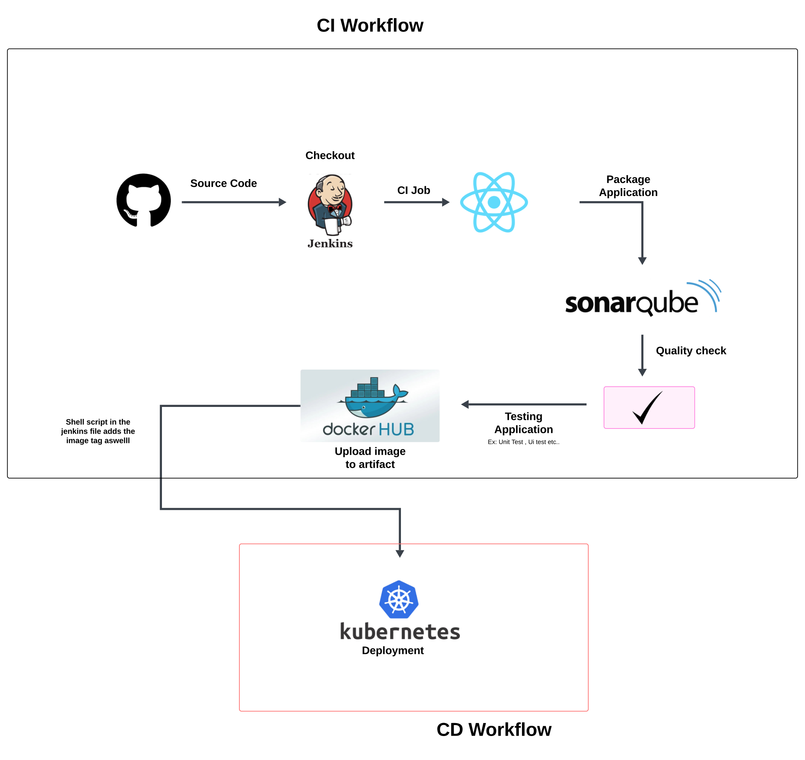

# Jenkins Pipeline

This repository contains a Jenkins Pipeline that builds, scans, tests, and deploys a react web app application to a Kubernetes cluster.

### Prerequisites
- [Jenkins](https://www.jenkins.io/)
- [Kubernetes](https://kubernetes.io/)
- [Git](https://git-scm.com/)

### Pipeline
The pipeline consists of the following stages:
1. Checkout: Checkout the code from the Git repository.
2. Build: Build the react web app using the `npm run build` command.
3. Scan: Scan the built react web app using the `npm run scan` command.
4. Deploy: Deploy the react web app to the Kubernetes cluster using the `kubectl apply` command.

### Kubernetes Deployment
The Kubernetes deployment is defined in the `k8s-deployment.yaml` file. It specifies the container image to use, the number of replicas, and the port to expose.

### Jenkins CI/CD
### Architecture 

